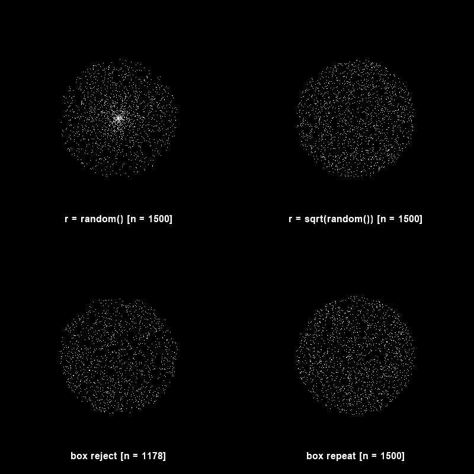

# Experiments

Repository with small experiments

## Random Distribution (distribution.py)

Shows the different random distributions for a circle depending on the method
used. Choosing r as random uniform, applying the square root of r, generating
random points inside a box and rejecting those outside the circle or repeating
instead of rejection until the point is inside the circle.

### Usage

This script uses Python 3 with numpy, Pillow and pyglet. To install
dependencies:

`$ pip install numpy Pillow pyglet`

To run the script:

`$ python distribution.py`

## NRT Numba Ray Tracer (nrt.py)

Compares the speed in a simple raytracer between regular Python and Numba.

Regular python takes: 268 seconds

Numba takes: 17 seconds

That's 15x speed up!

The image is 1400x1050 with 9 samples per pixel. Ran in a single thread in
a Ryzen 9 4900HS CPU.
